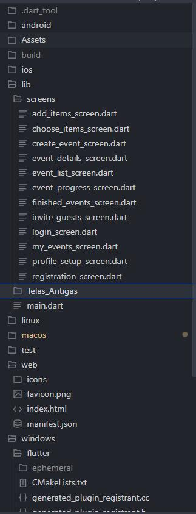
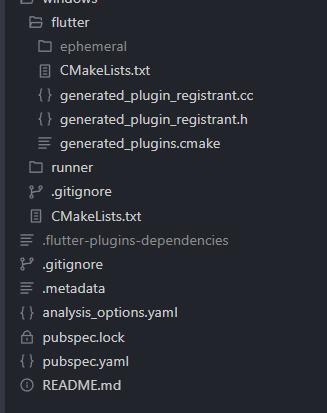
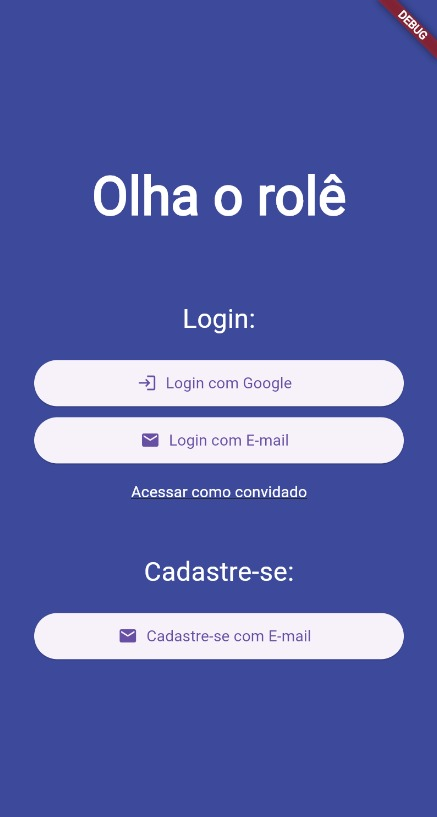
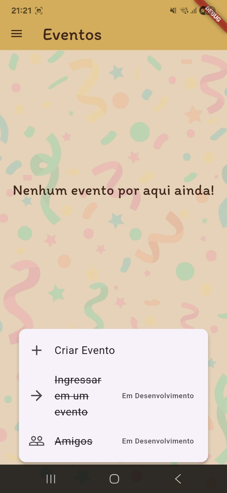
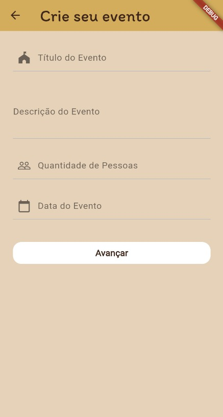
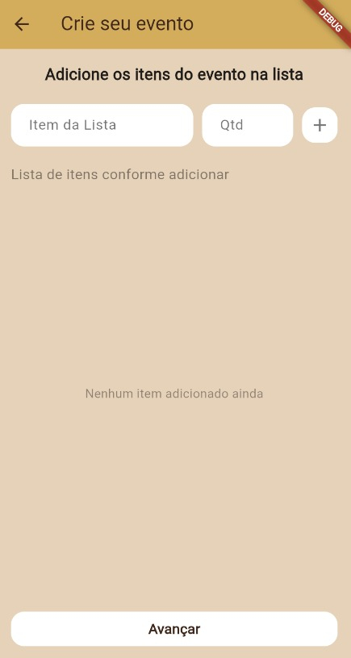
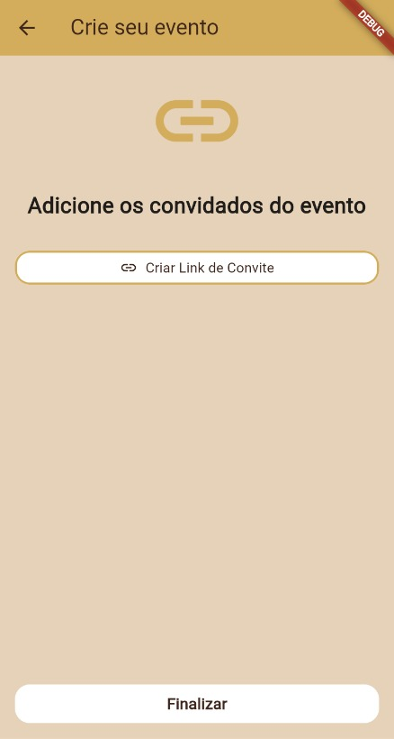
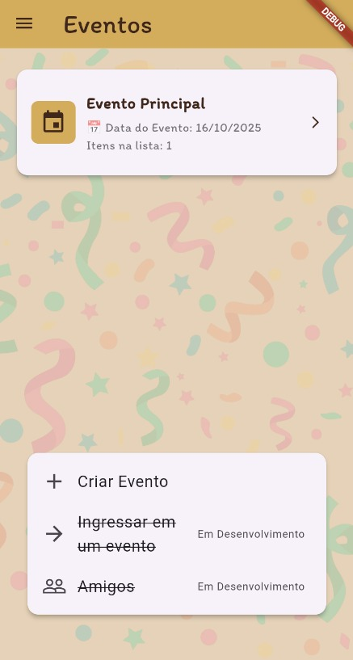
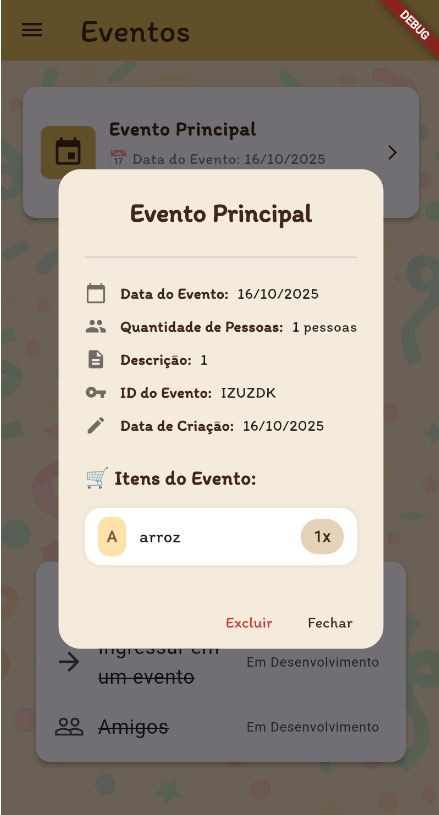

## Olha o Rolê

Olha o Rolê é um Aplicativo Mobile desenvolvido em Dart, permitindo a criação e o gerenciamento de eventos de forma prática para o usuários e de forma simples, visual e interativa. 

# **Tecnologia Utilizadas**

## Front-end

Estruturação da página:  DART

- **Estruturação da página:**  DART
- **Estilização e responsividade:**  DART
- **Lógica de simulação e interatividade:**  DART

## Banco de Dados

- Biblioteca Hive - DART

## Back-end

- DART

# Objetivo

O aplicativo Olha o Rolê tem como intuito facilitar a organização de eventos e simplificar esse processo, permitindo a criação e o gerenciamento de eventos de forma prática, incluindo itens e permitindo que os participantes selecionem e se responsabilizem por eles, criando um evento de maneira justa e organizada.

# Público-Alvo

- A todos os envolvidos na aquisição de uma organização e facilidade em criações de Eventos Sociais.
- Todos os interessados.

# Funcionalidades Principais

- Criação de Eventos
- Entrada de dados:
Lista de itens
- Resultados:
Convite via link

# **Histórico**

- Armazenamento e listagem
- Visualização e exclusão de registros

# **Requisitos Funcionais**

**1.** Cadastro e login de usuários;
**2.** Criar eventos com nome, descrição, data, quantidade de participantes e itens;
**3.** Gerar link para convidar participantes;
**4.** Ingressar em evento através de link;
**5.** Editar evento (somente o criador);
**6.** Permitir que cada participante selecione um item da lista;
**7.** Visualizar lista de participantes e ao lado o item selecionado;
**8.** Consultar, adicionar e/ou remover amigos dentro do aplicativo;
**9.** Acessar o histórico de eventos passados;
**10.** Reutilizar eventos como modelos;
**11.** Convidar amigos diretamente para novos eventos.

# **Requisitos Não Funcionais**

**1.** Precisa ser intuitivo e de fácil navegação;
**2.** Deve funcionar em dispositivos android com versão mínima 8.0;
**3.** O armazenamento local será implementado para funcionamento offline;
**4.** Dados sensíveis (senha) devem ser armazenados de forma segura (hash);
**5.** O tempo de resposta entre as ações do usuário e retorno do sistema, não devem ultrapassar 2 segundos. 

# **Testes**

**1.** Testes manuais na interface;
**2.** Testes de Usabilidade;
**3.** Testes de responsividade em diferentes dispositivos.

# **Estrutura do Projeto**

# **Equipe de Desenvolvimento**

Brenno Magalhães Gonçalves, **RA:** 2939184 
Desenvolvedor Front-End, Testador.

Christian Arruda Silva da Hora, **RA:** 2356889
Desenvolvedor Front-End, Testador.

Jessica Souza do Nascimento, **RA:** 2393505
Analista de Requisitos, Testador.

Júlia Martins de Toledo, **RA:** 2407220
Consultoria, Testador.

# **Prazo de entrega**

- Projeto será dividido em 2 partes
- Prazo de entrega máximo 1 parte: 20/10/2025

# **Histórico de Alterações**

Caso sejam realizadas alterações no software, documente nesta área com as respectivas informações:

**1.** Dados;
**2.** Versão da Descrição;
**3.** Requisito (tipo: Funcionais, não funcionais);
**4.** Autor.

# **Página de destino**

